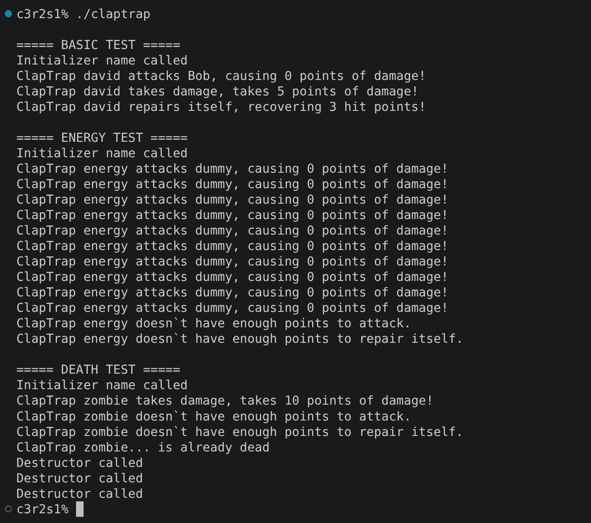
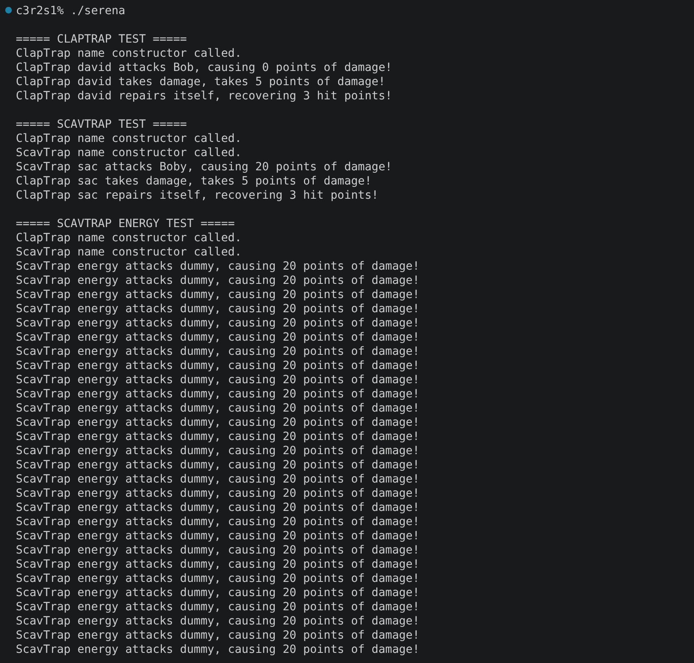

# cpp_module_03

### Clarifications and general tips:

* If you find any kind of error or have suggestions to improve, please do not hesitate to point them out in the `issues` section! Obviously always respectfully, thank you :D.
* All the executable files that this project creates have been selected by me. For your own project, you can use whatever names you prefer to create your files, always keeping the subject in mind. 
* In these exercises there aren't any main examples, you will have to create your own ones.
Always remember that the output examples are just examples. They can vary in your own project and still be fine.

## ex00: Aaaaand... OPEN!

### Mandatory requirements:

* Create a `ClapTrap` class with the following private attributes:
  * `name`
  * **Hit points**: `10` (represents ClapTrap's health)
  * **Energy points**: `10`
  * **Attack damage**: `0`
  * Implement:
    * `void attack(const std::string& target);`: 
      * When ClapTrap uses it, `target` (which is not an object or a class, but the string parameter passed to attack()) represents an imaginary enemy that receives damage equal to ClapTrap's `attack damage`.
      * ClapTrap lose **1 energy points after** an attack.  
    * `void takeDamage(unsigned int amount);`
      * This function should make ClapTrap lose `hit_points` when receiving an attack. (Do not forget the case when ClapTrap doesn't have any `hit_points` and its dead).
    * `void beRepaired(unsigned int amount);`: 
      * When ClapTrap uses it, it regains `hit_points` equal to `amount` value (The string passed as parameter in `takeDamage`), but also lose **1 energy points** after repairing itself.
    * All these member functions must report the target and the damage caused in a message similar to this one (without brackets): 
      `ClapTrap <name> attacks <target>, causing <damage> points of damage!`
  * The ClapTrap instances should not interact directly with one another
  * A `ClapTrap` cannot act if it has no hit points or no energy points.
* Constructors and destructors must print messages.

### What can we learn about this exercise?:

This exercise introduces the basic class structure used throughout the module and prepares us for **inheritance**. It also reinforces resource management and class encapsulation.

### Output example:

## ex01: Serena, my love!

### Mandatory requirements:

* Create a `ScavTrap` class that *inherits* from `ClapTrap`.
* `ScavTrap` must have:
  * **Hit points**: `100`
  * **Energy points**: `50`
  * **Attack damage**: `20`
  * Functions: 
    * Same as ClapTrap, but constructors, destructor and `attack()` must display different messages from `ClapTrap`.
  * `void guardGate();`
    * This function must display a message indicating that ScavTrap is now in Gate keeper mode (You don't even need a flag, if you want you can only code the message display).
* Show the correct **construction and destruction chaining** in your tests:
  * `ClapTrap` should be constructed first.
  * `ScavTrap` should be constructed afterward.
  * Destruction happens in the reverse order.
* Add more tests to verify the inherited behavior.

### What can we learn about this exercise?:

The main goal is to understand **inheritance**, how a derived class reuses the attributes and functionality of a base class, and how constructors and destructors should be chained when base and derived objects are created or destroyed.

### Output example:

---

## ex02: Repetitive work

### Mandatory requirements:

* Create a `FragTrap` class that inherits from `ClapTrap`.
* `FragTrap` must have:
  * **Hit points**: `100`
  * **Energy points**: `100`
  * **Attack damage**: `30`
  * Functions
    * Constructors and destructor must display different messages (As in FragTrap).
  * `void highFivesGuys(void);`
    * Works similar as guardGate.
* Show the correct construction/destruction chaining in your tests.
* Add additional tests for the inherited and new functionality.

### What can we learn about this exercise?:

This exercise reinforces **inheritance** and class specialization. `FragTrap` shares common functionality with `ClapTrap` while defining its own characteristics and special ability.

### Output example:

---

#### Last but not least, check out these other repositories if you feel lost, they helped me a lot through the project:

https://github.com/durantecode/CPP-03, 
https://github.com/tblaase/CPP-Module-03